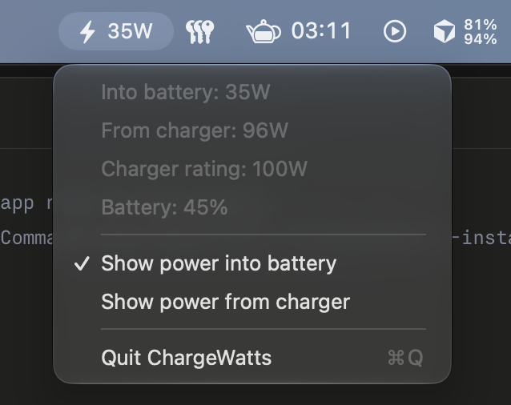

# ChargeWatts

A tiny macOS menu bar app that shows the wattage your MacBook is charging at, and disappears when it isn't charging.



No settings window, no Dock icon, no network access, no dependencies. One Swift file, under 200 lines.

## Features

- Live charging wattage in the menu bar, refreshed every 2 seconds
- Hidden completely when you're on battery, fully charged, or held at a charge limit
- Click it to see power into the battery, power from the charger, the charger's rated wattage and battery percentage
- Choose which number the menu bar shows: power into the battery (default) or power from the charger
- Launch at Login toggle in the menu

## Install

### Download

1. Grab `ChargeWatts.zip` from the [latest release](https://github.com/AndreCamm/ChargeWatts/releases/latest) and unzip it.
2. Move `ChargeWatts.app` to your Applications folder.
3. Open it. The app isn't notarised by Apple, so the first time macOS will block it. Go to **System Settings, Privacy & Security**, scroll down and click **Open Anyway**. Alternatively, run:

   ```
   xattr -dr com.apple.quarantine /Applications/ChargeWatts.app
   ```

### Build from source

You need Xcode or the Command Line Tools (`xcode-select --install`).

```
git clone https://github.com/AndreCamm/ChargeWatts.git
cd ChargeWatts
./build.sh
cp -r build/ChargeWatts.app /Applications/
open /Applications/ChargeWatts.app
```

Apps you build yourself aren't quarantined, so there's no Gatekeeper prompt.

## Using it

**Nothing appears when I open it.** That's expected unless the Mac is actively charging. Plug in a charger with the battery below full and the bolt will show up within a couple of seconds. On MacBooks with a notch, a crowded menu bar can also push items behind the notch.

**Start at login.** Click the item and tick **Launch at Login** (macOS 13 or later). On macOS 12, add ChargeWatts under System Settings, General, Login Items instead.

**Quit.** Click the item and choose Quit. If it's hidden because you're not charging, run `killall ChargeWatts` in Terminal.

## Why doesn't it match my wall meter?

There are three different numbers, measured at different points:

| Where | Example | What it is |
|---|---|---|
| Wall socket | 103W | What the power brick draws from the mains |
| From charger | 96W | What reaches the Mac. The difference is lost as heat in the brick |
| Into battery | 35W | What's left after the Mac takes what it needs to run |

So with those numbers the Mac itself is using about 61W, and the rest goes into the battery. If you want the figure closest to your wall meter, click the item and choose **Show power from charger**.

Charging also slows down on its own as the battery passes roughly 80%, because macOS tapers charging to protect the battery.

## How it works

macOS publishes live battery data in the IORegistry under `AppleSmartBattery`. ChargeWatts reads it every 2 seconds:

- **Into battery** is `Voltage` multiplied by `Amperage`
- **From charger** is `PowerTelemetryData.SystemPowerIn` (Apple Silicon only)
- **Charger rating** is `AdapterDetails.Watts`, the wattage the charger and Mac negotiated
- **Charging** means `ExternalConnected` and `IsCharging` are both true and some power is actually flowing in

You can see the same raw data yourself with:

```
ioreg -rn AppleSmartBattery
```

## Requirements

- macOS 12 Monterey or later
- A Mac with a battery. The "from charger" figure needs Apple Silicon

## Contributing

Issues and pull requests are welcome. The whole app lives in [`Sources/ChargeWatts.swift`](Sources/ChargeWatts.swift), and the aim is to keep it small and single purpose.

## License

[MIT](LICENSE)
